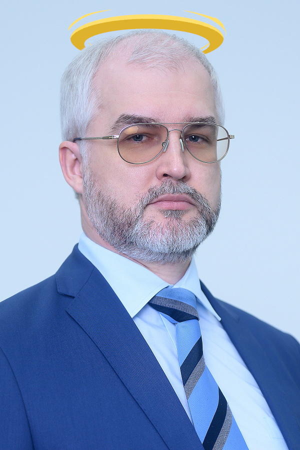

# I Love Karpov

Репозиторий проектов по программированию у групп, в которых ведёт Карпов Дмитрий Анатольевич (Это как минимум РСБО и РГБО). В репозиторий выкладывается исключительно исходный код проектов, который распространяется по стандартной лицензии MIT, так что за качество кода и работоспособность я не отвечаю. Создан этот репозиторий был в образовательных, развлекательных целях, а также с целью сохранить свои и, возможно, чужие нервы.

*Карпов Дмитрий Анатольевич <3*

---

## Лицензия

Как и писалось в первом абзаце, репозиторий и все загруженные в него **проекты находятся под лицензией MIT, текст которой можно прочитать [Здесь на английском](./LICENSE.md) и [Здесь на русском](./LICENSE_RU.md)**

---

## Кратко о контенте

На данный момент в репозитории есть 2 директории: **sem1** и **sem2**, которые отвечают за то, к какому семестру проекты относятся. Так как далеко не все работы с первого семестра у меня остались, в той папке совсем немного работ. "Совсем мои" работы, то есть работы, которые я сдал сам, я называю с началом `nvi`. Для работ, которые делаю не для себя, я предпочитаю использовать просто `lr`. Конкретный контент стоит прочитать в README файлах конкретных директорий.

Также в репозитории находится директория **scripts**, в которой лежит некоторое количество скриптов, которые помогают мне при администрировании репозитории, но могут также помочь пользователям. Написаны они под **sh**, так что использование подразумевает *Unix-like* ОС.

---

## Вклад в репозиторий

Если есть желание, я могу выложить какие-то работы, которые делал не сам, для этого можно:
1. Сделать пул-реквест, файлы которого не будут содержать `user` файлы, билды. Пул-реквест также должен содержать копию файла `LICENSE_RU.md` в виде `LICENSE` файла внутри каждой папки проекта (допускается только изменение имени автора и года)
2. Скинуть мне архив с работой(работами) или репозиторий с ней(ними). Также надо указать авторство работы, чтобы автор был включён в текст лицензии. Если лицензия не будет указана, будет использована лицензия из файла `LICENSE_RU.md`

Также приветствуются пул-реквесты или сообщения в лс по поводу исправления или ошибок опечаток в тексте, добавлению или улучшению скриптов и т.п.

---

## Авторство

Сделал этот репозиторий Нагорный Владислав Игоревич, студент N курса РТУ МИРЭА, группа РСБО-01-20.

Контакты:
- [Вконтакте](https://vk.com/uslashvlad)
- [Телеграм](https://t.me/uslashvlad)
- [Почта](mailto:idroidservv@gmail.com)
